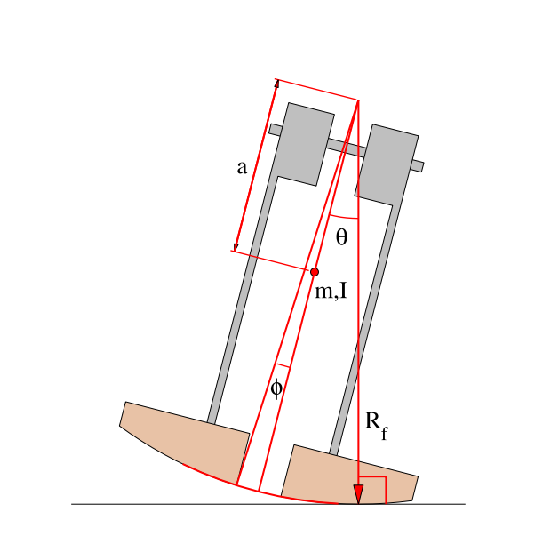
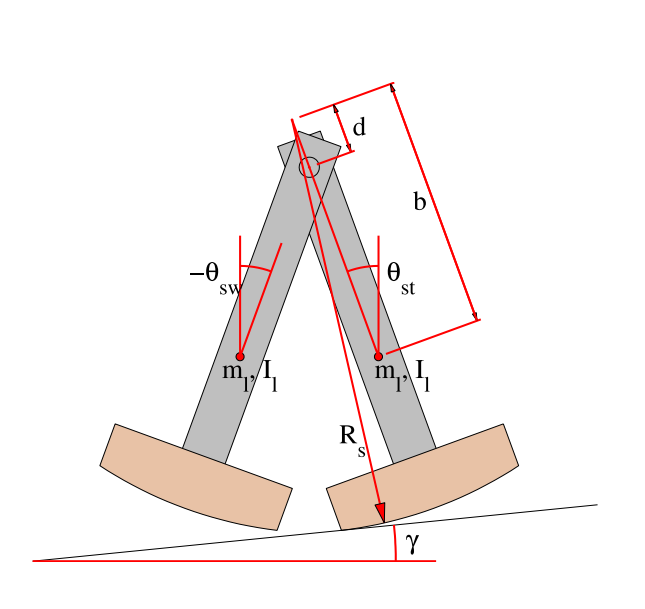

Title: 期末協同查驗與自評
Date: 2017-06-14 11:00
Category: Course
Tags: solvespace, v-rep, w17
Slug: final-collaboration-evaluation
Author: yen

以下為協同產品設計實習 2017 Spring 期末考前一週起的實習查驗題目. 完成後, 請各組員依照指示完成期末自評簡報.

<!-- PELICAN_END_SUMMARY -->

以下各題請各組員在任務執行時, 利用 ShareX 拍攝操作影片, 影片名稱依題序設為"學號-2017springcd-final-1.mp4 ~ 學號-2017springcd-final-7.mp4", 並在指定時間內分別上傳到以學號建立帳號的 Youtube 與 Vimeo.

1. 各組員倉儲中的 Github 檔案推送

2. 各組員網誌上的 2D 繪圖, 並將程式碼顯示在繪圖網誌文章中

3. 各組員倉儲中的子模組建立與運用, 並將程式碼顯示在繪圖網誌文章中

4. 各組員 Solvespace 近端零組件繪圖, 並在各組員網誌中顯示指定的零組件

5. 各組員 Solvespace 零件轉入 V-rep, 並設定驅動零件進行動態模擬

6. 各組員說明在分組行走機構模擬與實作過程中所扮演的角色, 並利用影片檔說明所負責完成的任務

7. 各組以協同方式整合各組組員所完成的倉儲, 網誌與操作影片後, 以學號名稱當作子目錄, 其中放入各組員上述各題所完成的操作影片後, 上傳到各組在系上的 Fossil SCM 倉儲, 並設法用各組的 Github Pages 進行分組簡報.

參考資料: 

<a href="./../data/final/TheSimplestWalkingModelStabilityComplexity_and_Scaling.pdf">TheSimplestWalkingModelStabilityComplexity_and_Scaling.pdf</a>

<a href="./../data/final/Actuating_a_Simple_3D_Passive_Dynamic_Walker.pdf">Actuating_a_Simple_3D_Passive_Dynamic_Walker.pdf</a>

<a href="./../data/final/DESIGN_OF_PASSIVE_DYNAMIC_WALKING_ROBOTS.pdf">DESIGN_OF_PASSIVE_DYNAMIC_WALKING_ROBOTS.pdf</a>

<a href="./../data/final/Adding _an_Upper_Body_to_Passive_Dynamic_Walking.pdf">Adding _an_Upper_Body_to_Passive_Dynamic_Walking.pdf</a>

<a href="./../data/final/Learning_to_Walk_in_20_Minutes.pdf">Learning_to_Walk_in_20_Minutes.pdf</a>

<a href="./../data/A_Three-Dimensional_walker.pdf">A_Three-Dimensional_walker.pdf</a>

<a href="./../data/final/Underactuated_Robotics.pdf">Underactuated_Robotics.pdf</a>

<a href="./../data/final/Design_Construction_and_Experiments_compass_gait_robot.pdf">Design_Construction_and_Experiments_compass_gait_robot.pdf</a>

<a href="./../data/final/Compass-Like Biped Robot Part I  Stability and.pdf">Compass-Like Biped Robot Part I  Stability and.pdf</a>

<a href="./../data/final/HEXAPOD_robot.pdf">HEXAPOD_robot.pdf</a>

<iframe width="560" height="315" src="https://www.youtube.com/embed/N64KOQkbyiI" frameborder="0" allowfullscreen></iframe>

<a href="http://www.forum.coppeliarobotics.com/viewtopic.php?f=9&t=1137">http://www.forum.coppeliarobotics.com/viewtopic.php?f=9&t=1137</a>